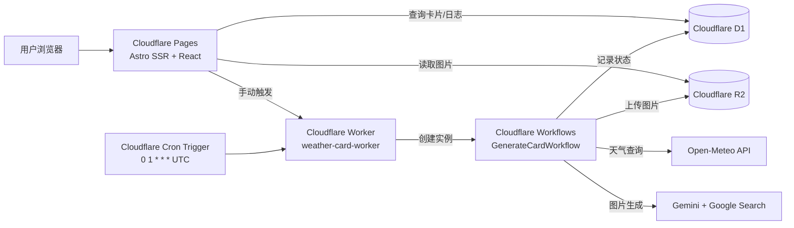

# Weather Card 架构说明

本文档描述 `WeatherCardXHS` 在 Cloudflare 上的运行架构，包括 `Workers`、`Pages`、`D1`、`R2`、`Workflows` 的职责与关系。

- 部署步骤请看: [deployment.md](./deployment.md)

## 1. 架构总览

## 2. 组件职责

| 组件 | 实例/绑定 | 核心职责 |
|---|---|---|
| Cloudflare Pages | `apps/web` (`name: weather-card`) | 提供前端页面和 API 路由（`/api/cards`、`/api/logs`、`/api/images/*`、`/api/trigger`） |
| Cloudflare Worker | `apps/worker` (`name: weather-card-worker`) | 接收 `cron` 和手动触发请求，创建 Workflow 实例 |
| Cloudflare Workflows | `binding: GENERATE_CARD` / `class: GenerateCardWorkflow` | 编排“查天气 -> 生成图 -> 上传 R2 -> 更新 D1”完整流程 |
| Cloudflare D1 | `binding: DB` / `weather-card-db` | 持久化任务状态、天气信息、图片 key、错误信息 |
| Cloudflare R2 | `binding: BUCKET` / `weather-card-images` | 存储最终天气卡片图片 |

## 3. 关键调用链

### 3.1 每日自动生成链路

1. Cloudflare `cron` 按 `0 1 * * *` 触发 Worker（UTC 时间）。
2. Worker 在 `scheduled()` 中调用 `env.GENERATE_CARD.create()` 创建 Workflow 实例。
3. Workflow 先在 D1 写入 `generation_runs` 记录，状态 `running`。
4. Workflow 调 Open-Meteo 获取天气（失败时降级，不中断整个流程）。
5. Workflow 调 Gemini（带 Google Search 工具）生成图片。
6. Workflow 将图片上传到 R2，得到 `image_r2_key`。
7. Workflow 更新 D1 为 `succeeded`；若异常则更新为 `failed` 并记录 `error_message`。

### 3.2 手动触发链路

1. 管理员访问 `/create?token=<TRIGGER_TOKEN>`。
2. 页面调用 `POST /api/trigger`（Pages 侧 API）。
3. Pages API 读取 `WORKER_URL`，转发请求到 Worker `/trigger`，并在请求头加 `Authorization: Bearer <TRIGGER_TOKEN>`。
4. Worker 校验 `TRIGGER_TOKEN` 后创建 Workflow 实例执行。

### 3.3 前台展示链路

1. Gallery 调 `GET /api/cards` 从 D1 拉取 `succeeded` 记录。
2. 图片通过 `GET /api/images/<r2-key>` 由 Pages 从 R2 读取并返回。
3. Logs 页调 `GET /api/logs` 查看运行历史。

### 3.4 内部接口链路

1. `GET /api/internal/cards` 需 `Authorization: Bearer <INTERNAL_API_KEY>`。
2. 接口返回卡片列表并拼装绝对 `image_url`，供可信内部系统消费。

## 4. 数据模型（D1）

核心表: `generation_runs`

- 主键与唯一键: `id`, `run_id`
- 任务字段: `status`, `duration_ms`, `error_message`
- 业务字段: `city`, `resolved_city_name`, `weather_date`, `weather_condition`, `temp_min/max/current`
- 存储定位: `image_r2_key`
- 时间字段: `created_at`, `updated_at`

## 5. 安全与边界

- `TRIGGER_TOKEN` 控制手动触发入口（Worker `/trigger` 与 Pages `/create`、`/api/trigger` 一致）。
- `INTERNAL_API_KEY` 保护 `/api/internal/cards`。
- Pages `middleware` 对 `/api/*` 做 IP 级限流；带内部 `Bearer` 的请求可跳过限流。
- `/api/images/*` 含 Referer 同源校验，降低外站盗链风险。

## 6. 部署依赖顺序

推荐顺序如下：

1. 创建并绑定 D1、R2（必要时包含 Pages 的 `SESSION` KV）。
2. 设置 Worker 与 Pages 环境变量/密钥。
3. 先部署 Worker（确保 `WORKER_URL` 可用）。
4. 执行 D1 远端迁移。
5. 部署 Pages。

完整命令与操作细节请看: [deployment.md](./deployment.md)

